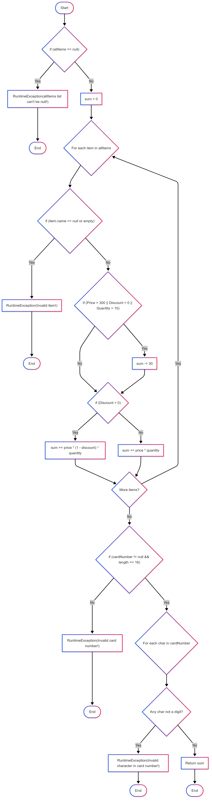

# Втора лабораториска вежба по Софтверско инженерство

## Кирил Јанев, бр. на индекс 233035

### Control Flow Graph

### Цикломатска комплексност
Цикломатската комплексност на дадениот код може да ја пресметаме со формулата CC = P + 1, каде P = број на услови (if, for, while, switch, case, catch, ? :, &&, ||), +1 се додава бидејќи и без услови, програмата има барем една патека. Според оваа формула добиваме дека **CC = 8 + 1 = 9**. (Освен оваа формула може да ја користиме и формулата CC = E - N + 2, каде N е Nodes и Е е Edges).

### Тест случаи според критериумот Every statement
**Тест Случај 1: Валидна кошничка без попуст**  
List<Item> items = List.of(new Item("Milk", 2, 100, 0));  
String cardNumber = "1234567890123456";  
checkCart(items, cardNumber);  
Цел: Да се извршат сите „нормални“ statements без да се активираат throw изјави.  
Покрива: сите изјави освен фрлање грешки.

**Тест Случај 2: allItems == null**  
checkCart(null, "1234567890123456");  
Покрива изјава за фрлање грешка: RuntimeException: "allItems list can't be null!".

**Тест Случај 3: Item со невалидно име**  
ist<Item> items = List.of(new Item("", 1, 100, 0));  
checkCart(items, "1234567890123456");  
Покрива изјава за фрлање грешка: "Invalid item!".

**Тест Случај 4: Активирање на sum -= 30 и пресметка со попуст**  
List<Item> items = List.of(new Item("Expensive", 2, 400, 0.1));  
checkCart(items, "1234567890123456");  
Покрива пресметка на sum -= 30 и sum += price * (1 - discount) * quantity.

**Тест Случај 5: Невалиден број на картичка (не се 16 цифри)**  
Покрива изјава за фрлање грешка: "Invalid card number!".

**Тест Случај 6: Невалиден карактер во број на картичка**  
List<Item> items = List.of(new Item("Item", 1, 100, 0));  
checkCart(items, "123456789012345a");  
Покрива изјава за фрлање грешка: "Invalid character in card number!".

Минимален број на тест случаи според Every Statement критериумот би бил 6.

### Тест случаи според критериумот Multiple Condition
Според Multiple Condition критериумот за дадениот услов, потребни ни се 8 тест случаи за целосно покривање.

**T1 - Ниеден услов не е исполнет**  
new Item("Item1", 5, 200, 0.0); // false || false || false

**T2 - Само quantity > 10**  
new Item("Item2", 11, 200, 0.0); // false || false || true

**T3 - Само discount > 0**  
new Item("Item3", 5, 200, 0.1); // false || true || false

**T4 - discount и quantity исполнети**  
new Item("Item4", 15, 200, 0.2); // false || true || true

**T5 - Само price > 300**  
new Item("Item5", 5, 350, 0.0); // true || false || false

**T6 - price и quantity исполнети**  
new Item("Item6", 12, 400, 0.0); // true || false || true

**T7 - price и discount исполнети**  
new Item("Item7", 5, 350, 0.2); // true || true || false

**T8 - Сите услови исполнети**  
new Item("Item8", 15, 350, 0.2); // true || true || true
